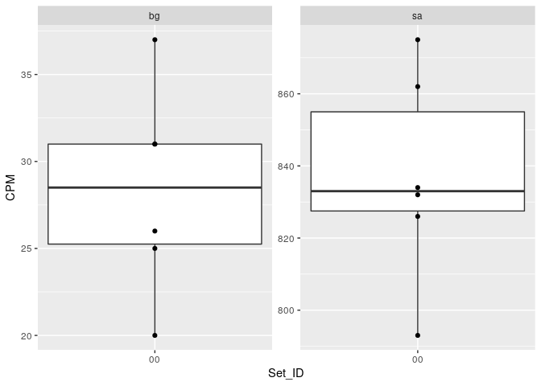
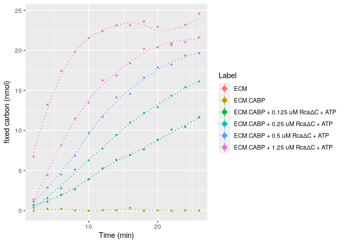
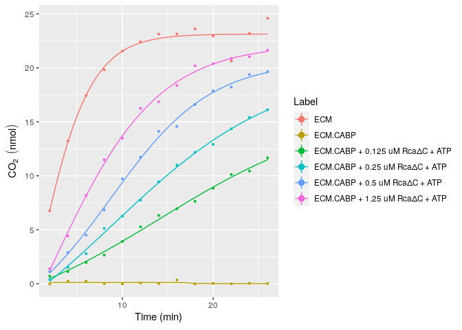
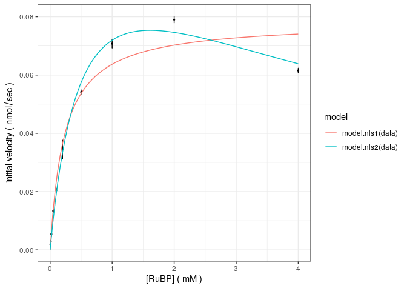

<!-- README.md is generated from README.Rmd. Please edit that file -->

# hitac2

**Warning: This package is still under development \!**

## Installation

You can install the released version of hitac2 from GitHub.

``` r
# should not work, since the repo is private
# devtools::install_github("mirkko-hub/hitac2")
```

``` r
library(tidyverse, warn.conflicts = FALSE)
#> ── Attaching packages ────────────────────────────────────────────────────────────────────────────────────────────────────────────────────── tidyverse 1.3.0 ──
#> ✓ ggplot2 3.3.2     ✓ purrr   0.3.4
#> ✓ tibble  3.0.3     ✓ dplyr   1.0.2
#> ✓ tidyr   1.1.2     ✓ stringr 1.4.0
#> ✓ readr   1.4.0     ✓ forcats 0.5.0
#> ── Conflicts ───────────────────────────────────────────────────────────────────────────────────────────────────────────────────────── tidyverse_conflicts() ──
#> x dplyr::filter() masks stats::filter()
#> x dplyr::lag()    masks stats::lag()
library(magrittr, warn.conflicts = FALSE)
library(hitac2)
library(minpack.lm)
```

### Example workflow

  - read data

<!-- end list -->

``` r
ha_data <- hitachi_read(system.file("extdata", "D0X00000.001", package = "hitac2", mustWork = TRUE))
design <- read_csv(system.file("extdata", "design.csv", package = "hitac2", mustWork = TRUE))
#> 
#> ── Column specification ───────────────────────────────────────────────────────────────────────────────────────────────────────────────────────────────────────
#> cols(
#>   Hitachi_ID = col_double(),
#>   Exp_ID = col_double(),
#>   Time_s = col_double(),
#>   Group = col_character(),
#>   Join_bg = col_double(),
#>   Join_sa = col_double(),
#>   FLAG = col_logical()
#> )
treatment <- read_csv(system.file("extdata", "treatment.csv", package = "hitac2", mustWork = TRUE))
#> 
#> ── Column specification ───────────────────────────────────────────────────────────────────────────────────────────────────────────────────────────────────────
#> cols(
#>   Group = col_character(),
#>   Concentration_RuBP_mM = col_double(),
#>   NaHCO3_uM = col_double(),
#>   Concentration_KCl_mM = col_double(),
#>   Concentration_CABP_uM = col_double(),
#>   Tube = col_character(),
#>   pH = col_double(),
#>   Buffer = col_character(),
#>   DTT_mM = col_double(),
#>   Temperature_C = col_double(),
#>   Rubisco = col_character(),
#>   L1S1_uM = col_double(),
#>   Rca = col_character(),
#>   Rca6_uM = col_double(),
#>   Additive = col_character(),
#>   Additive_mM = col_double(),
#>   Label = col_character()
#> )

ha_data <- left_join(ha_data, design, by = "Hitachi_ID")
```

  - calculate specific activity (sa) and do background subtraction (bg)
  - *how many CPM per given amount of NaHCO3?*

<!-- end list -->

``` r
table_activity <- hitachi_tibble(data = ha_data, treatment = treatment, V_RuBP = 4e-06, C_RuBP = 6e-04, convert = TRUE)
```

  - quick check of control samples (sa and bg)

 \*
quick check of actual data

    #> `summarise()` regrouping output by 'Label' (override with `.groups` argument)
    #> `geom_smooth()` using method = 'loess' and formula 'y ~ x'
    #> Warning: Removed 78 rows containing missing values (geom_segment).



### Add some models

  - fit an inappropriate model and plot for visualization

<!-- end list -->

``` r
# model
sigmoidal_nls_4p <- function(df){
  `minpack.lm`::nlsLM(Activity_nmol ~ asym_high + ((asym_low - asym_high) / (1+exp(slope * (Time_min - Time_inflect)))),
      data = df,
      start = list(asym_low = min(df$Activity_nmol),
                   asym_high = max(df$Activity_nmol),
                   slope = 1,
                   Time_inflect = max(df$Time_min) / 2))
}

# fit
data_dosedependence %>%
  mutate(Time_min = Time_s / 60) %>%
  select(Label, Time_min, Activity_nmol) %>%
  nest(data = c(Time_min, Activity_nmol)) %>%
  mutate(model = map(data, sigmoidal_nls_4p)) %>% select(Label, model) %>%
  right_join(tibble(
    Label = rep(.$Label %>% unique, each = 49),
    Time_min = rep(seq(2, 26, by = 0.5), 6)),
    by = "Label") %>%
  nest(data = c(Time_min)) %>%
  mutate(`Activity fitted` = map2(data, model, modelr::add_predictions, var = "Activity fitted")) %>%
  unnest(`Activity fitted`) %>%
  ggplot(.) +
  geom_line(aes(x = Time_min, y = `Activity fitted`, colour = Label)) +
  # for multiple replicates
  geom_pointrange(data = data_dosedependence %>%
                    mutate(Time_min = Time_s / 60) %>%
                    group_by(Label, Time_min) %>%
                    summarise(Activity_avg = mean(Activity_nmol), Activity_sd = sd(Activity_nmol)),
                  mapping = aes(x = Time_min, y = Activity_avg,
                                ymin = Activity_avg - Activity_sd,
                                ymax = Activity_avg + Activity_sd, colour = Label),
                  fatten = 0.2) +
  labs(x = expression(paste("Time (min)")), y = expression(CO[2] ~ (nmol)))
#> Warning: Problem with `mutate()` input `model`.
#> ℹ lmdif: info = -1. Number of iterations has reached `maxiter' == 50.
#> 
#> ℹ Input `model` is `map(data, sigmoidal_nls_4p)`.
#> Warning in nls.lm(par = start, fn = FCT, jac = jac, control = control, lower = lower, : lmdif: info = -1. Number of iterations has reached `maxiter' == 50.
#> `summarise()` regrouping output by 'Label' (override with `.groups` argument)
#> Warning: Removed 78 rows containing missing values (geom_segment).
```



  - how about a michaelis-menten plot?

<!-- end list -->

``` r
# some more data
michaelis_menten
#> # A tibble: 180 x 4
#>    ExpID Concentration  Time Activity
#>    <int>         <dbl> <int>    <dbl>
#>  1     1         0.005    20  -0.0162
#>  2     2         0.005    40   0.0522
#>  3     3         0.005    60   0.171 
#>  4     4         0.005    80   0.147 
#>  5     5         0.005   100   0.187 
#>  6     6         0.005   120   0.205 
#>  7     7         0.005    20   0.0233
#>  8     8         0.005    40   0.136 
#>  9     9         0.005    60   0.108 
#> 10    10         0.005    80   0.155 
#> # … with 170 more rows

# fit groupwise (1 per Concentration), linear models
ha_extract_lm <- hitachi_extract_lm(data = michaelis_menten) # raw-data for plotting linear models

# extract estimates of linear model
ha_extract_rate <- hitachi_extract_rate(ha_extract_lm)

# build model matrix
ha_modelmatrix <- hitachi_model(ha_extract_rate)

# plot
ggplot(ha_extract_rate, aes(x = S, y = v)) +
  theme_bw() +
  labs(y = expression(paste("initial velocity ( ", nmol / sec, " )")), x = expression(paste("[RuBP] ( ", mM, " )"))) +
  geom_point(size = 0.5) +
  geom_errorbar(data = ha_extract_rate, aes(x = S, ymin = v - std.error, ymax = v + std.error)) +
  geom_line(data = ha_modelmatrix, aes(x = S, y = Velocity_mod, colour = model))
```


